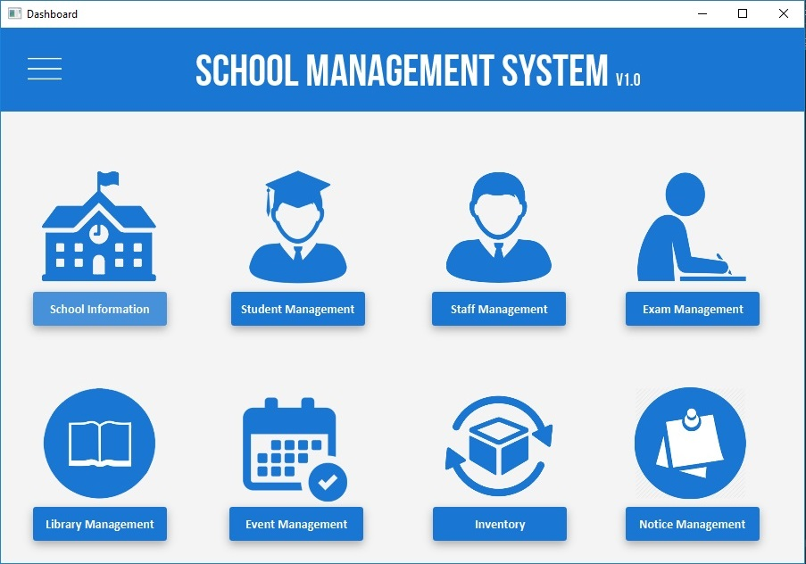

# School Management System
School Management System using Java FX
And also used UI and UX concepts and [JFoenix](http://www.jfoenix.com/) library

## Technologies Used
* JavaFX
* JFoenix (Material Design Library)
* Jasper Reports
* MySQL
* IntelliJ Idea Ultimate (IDE)

## Used Design Patterns
* MVC 

## Contributing

* **Ahamed Safnaj** - *Developer* - [Website](https://ahamedsafnaj.blogspot.com)

See also the list of [contributors](https://github.com/Safnaj/School-Management-System/graphs/contributors) who participated in this project.

## Authors

* **Ahamed Safnaj** - *Developer* Who's the author of those contents - [Safnaj](https://ahamedsafnaj.blogspot.com)

## License

This project is licensed under the Apache License - see the [LICENSE.md](LICENSE) file for details.

